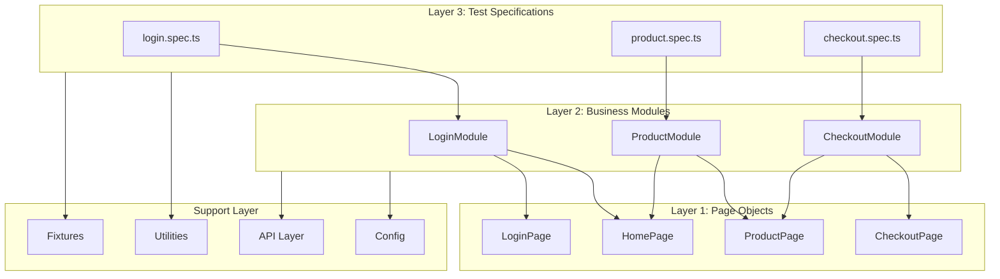
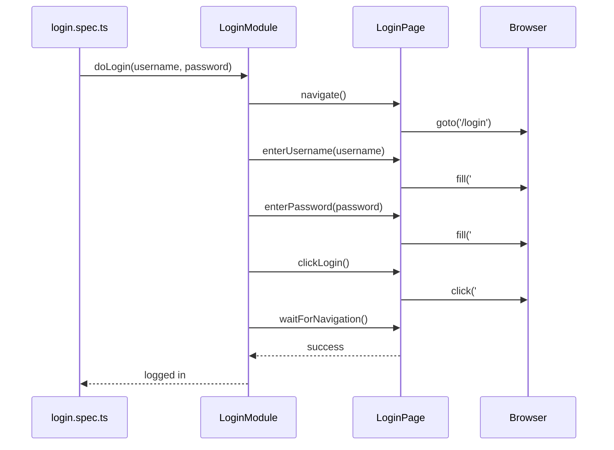
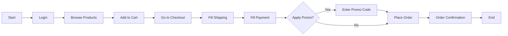

# 🎭 Playwright Test Automation Framework

A modular, scalable test automation framework built with **Playwright** and **TypeScript** using the **Page Object Model (POM)** and **Module Pattern** architecture.

> **Created by Om Gutty Reference by (https://thetestingacademy.com)** 

---

## 📊 Architecture Documentation

For a comprehensive visual architecture guide, see:

- 📄 **[Architecture Diagram (HTML)](docs/ARCHITECTURE.html)** - Interactive visual documentation
- 📋 **[Quick Reference Guide](docs/QUICK_REFERENCE.md)** - Commands and best practices
- 🤖 **[AI Agents + MCP Tutor Docs](docs/ai-agents/index.mdx)** - Class pack, prompts, and guardrails
- 🧩 **[Agent Instruction Templates](.github/instructions/)** - Planner, Generator, Healer repository rules

### Architecture Overview

<p align="center">
  
</p>

---

## 🌟 Key Features

- **Page Object Model (POM)** - Clean separation of test logic and page interactions
- **Module Pattern** - Business logic layer for complex workflows
- **API Testing Layer** - REST API testing with retry support
- **Custom Fixtures** - Pre-authenticated sessions and enhanced page handling
- **Multi-Browser Support** - Chrome, Firefox, Safari, and Mobile Chrome
- **TypeScript** - Full type safety and IntelliSense support
- **Parallel Execution** - Run tests in parallel across browsers

---

## 📁 Project Structure

```
Playwright_Framework/
├── src/
│   ├── api/                    # API testing layer
│   │   ├── AuthApi.ts          # Authentication API methods
│   │   ├── ProductApi.ts       # Product API methods
│   │   ├── OrderApi.ts         # Order API methods
│   │   └── index.ts            # API exports
│   ├── config/
│   │   └── index.ts            # Configuration & test data constants
│   ├── fixtures/
│   │   ├── auth.fixture.ts     # Pre-authenticated session fixtures
│   │   └── index.ts            # Main fixtures with page objects & modules
│   ├── modules/                # Business logic layer
│   │   ├── LoginModule.ts      # Login workflows
│   │   ├── ProductModule.ts    # Product workflows
│   │   ├── CheckoutModule.ts   # Checkout workflows
│   │   └── index.ts            # Module exports
│   ├── pages/                  # Page Object Model layer
│   │   ├── LoginPage.ts        # Login page locators & actions
│   │   ├── HomePage.ts         # Home page locators & actions
│   │   ├── ProductPage.ts      # Product page locators & actions
│   │   ├── CheckoutPage.ts     # Checkout page locators & actions
│   │   └── index.ts            # Page exports
│   ├── testdata/
│   │   ├── users.json          # User test data
│   │   ├── products.json       # Product test data
│   │   └── types.ts            # TypeScript type definitions
│   ├── tests/
│   │   ├── login.spec.ts       # Login test specifications
│   │   ├── product.spec.ts     # Product test specifications
│   │   └── checkout.spec.ts    # Checkout test specifications
│   └── utils/
│       ├── Logger.ts           # Structured logging utility
│       ├── WaitHelper.ts       # Custom wait conditions
│       ├── DataGenerator.ts    # Random test data generation
│       ├── ApiHelper.ts        # HTTP request helper with retry
│       └── index.ts            # Utility exports
├── playwright.config.ts        # Playwright configuration
├── tsconfig.json               # TypeScript configuration
├── package.json                # NPM scripts & dependencies
├── .env                        # Environment variables
└── .gitignore                  # Git ignore rules
```

---

## 🏗️ Architecture

### Three-Layer Architecture

The framework follows a **3-layer architecture** that promotes separation of concerns:

```
┌─────────────────────────────────────────────────────────────┐
│                    LAYER 3: TESTS                           │
│  (Test Specifications - login.spec.ts, product.spec.ts)     │
│  • Test scenarios and assertions                            │
│  • Uses Modules for business workflows                      │
└─────────────────────────────────────────────────────────────┘
                            │
                            ▼
┌─────────────────────────────────────────────────────────────┐
│                   LAYER 2: MODULES                          │
│  (Business Logic - LoginModule, ProductModule, etc.)        │
│  • Complex workflows and business logic                     │
│  • Orchestrates multiple Page actions                       │
└─────────────────────────────────────────────────────────────┘
                            │
                            ▼
┌─────────────────────────────────────────────────────────────┐
│                    LAYER 1: PAGES                           │
│  (Page Objects - LoginPage, ProductPage, etc.)              │
│  • Locators defined as arrow functions                      │
│  • Basic UI actions (click, fill, navigate)                 │
│  • No business logic                                        │
└─────────────────────────────────────────────────────────────┘
```

---

## 🚀 Getting Started

### Prerequisites

- Node.js 18+
- npm or yarn

### Installation

```bash
# Install dependencies
npm install

# Install Playwright browsers
npx playwright install
```

### Configuration

Update the `.env` file with your environment settings:

```env
BASE_URL=https://your-app-url.com
TEST_USERNAME=testuser
TEST_PASSWORD=testpass123
API_TIMEOUT=30000
```

---

## 📜 Available Scripts

| Command                 | Description                    |
| ----------------------- | ------------------------------ |
| `npm test`              | Run all tests in headless mode |
| `npm run test:headed`   | Run tests with browser visible |
| `npm run test:ui`       | Open Playwright UI mode        |
| `npm run test:debug`    | Debug tests with inspector     |
| `npm run test:chromium` | Run only Chromium tests        |
| `npm run test:firefox`  | Run only Firefox tests         |
| `npm run test:webkit`   | Run only WebKit tests          |
| `npm run test:mobile`   | Run mobile Chrome tests        |
| `npm run test:report`   | Show HTML test report          |
| `npm run build`         | Compile TypeScript             |
| `npm run clean`         | Clean build artifacts          |
| `npm run agents:init`   | Scaffold Playwright AI agent instruction files |
| `npm run rules:check`   | Run framework rule engine on all files |
| `npm run rules:changed` | Run framework rule engine on changed files |
| `npm run rules:staged`  | Run framework rule engine on staged files |

---

## 🧪 Test Coverage

| Test File          | Test Cases                      | Description                     |
| ------------------ | ------------------------------- | ------------------------------- |
| `login.spec.ts`    | 11                              | Login, logout, validation       |
| `product.spec.ts`  | 15                              | Product details, cart, wishlist |
| `checkout.spec.ts` | 10                              | Checkout flow, promo codes      |
| **Total**          | **36 tests × 4 browsers = 144** |                                 |

---

## 📊 Flow Diagrams

### Test Execution Flow



### Login Flow Example



### Checkout Flow



---

## 🔧 Usage Examples

### Using Page Objects

```typescript
import { LoginPage } from "../pages";

const loginPage = new LoginPage(page);
await loginPage.navigate();
await loginPage.enterUsername("user@example.com");
await loginPage.enterPassword("password123");
await loginPage.clickLogin();
```

### Using Modules

```typescript
import { LoginModule } from "../modules";

const loginModule = new LoginModule(page);
await loginModule.doLogin("user@example.com", "password123");
await loginModule.verifyLoggedIn();
```

### Using Fixtures

```typescript
import { test, expect } from "../fixtures";

test("should show dashboard after login", async ({ authenticatedPage }) => {
  // Page is already logged in via fixture
  await expect(
    authenticatedPage.locator('[data-testid="dashboard"]')
  ).toBeVisible();
});

test("with page objects", async ({ loginPage, homePage }) => {
  await loginPage.navigate();
  // Use pre-initialized page objects
});
```

### Using API Layer

```typescript
import { AuthApi, ProductApi } from "../api";

const authApi = new AuthApi();
const token = await authApi.login("user@example.com", "password");

const productApi = new ProductApi();
const products = await productApi.getProducts(token);
```

---

## 🛠️ Utilities

### Logger

```typescript
import { Logger } from "../utils";

const logger = new Logger("TestName");
logger.info("Starting test");
logger.debug("Debug information");
logger.error("Error occurred", error);
```

### WaitHelper

```typescript
import { WaitHelper } from "../utils";

const waitHelper = new WaitHelper(page);
await waitHelper.waitForCondition(async () => {
  return await page.locator(".loading").isHidden();
});
await waitHelper.retry(async () => await fetchData(), 3);
```

### DataGenerator

```typescript
import { DataGenerator } from "../utils";

const email = DataGenerator.randomEmail(); // user_abc123@test.com
const phone = DataGenerator.randomPhoneNumber(); // (555) 123-4567
const uuid = DataGenerator.uuid(); // 550e8400-e29b-41d4-a716-446655440000
```

---

## 📝 Writing New Tests

1. **Create Page Object** (if new page):

   ```typescript
   // src/pages/NewPage.ts
   export class NewPage {
     constructor(private page: Page) {}

     // Locators as arrow functions
     readonly submitButton = () => this.page.locator("#submit");

     // Actions
     async clickSubmit() {
       await this.submitButton().click();
     }
   }
   ```

2. **Create Module** (for business logic):

   ```typescript
   // src/modules/NewModule.ts
   export class NewModule {
     private newPage: NewPage;

     constructor(page: Page) {
       this.newPage = new NewPage(page);
     }

     async completeWorkflow() {
       // Orchestrate multiple page actions
     }
   }
   ```

3. **Write Test**:

   ```typescript
   // src/tests/new.spec.ts
   import { test, expect } from "../fixtures";
   import { NewModule } from "../modules";

   test("should complete workflow", async ({ page }) => {
     const module = new NewModule(page);
     await module.completeWorkflow();
     // Assertions
   });
   ```

---

## 📊 Custom TTA Reporter

This framework includes a **Custom TTA Reporter** - a beautiful, modern HTML reporter with real-time test execution updates.

### Features

| Feature | Description |
|---------|-------------|
| 🎨 **Modern UI** | Green-themed design with Google Fonts (Inter, JetBrains Mono) |
| 📊 **Stats Dashboard** | 6 metric cards showing Total, Passed, Failed, Skipped, Pass Rate, Duration |
| 📋 **Console Logs per Step** | Each `console.log()` in `test.step()` is captured and displayed |
| 🎬 **Screenshots & Videos** | Auto-captured on failure with inline previews |
| 📍 **Trace Viewer** | Direct links to Playwright trace files |
| 🔍 **Filters** | Filter by Priority (P0, P1, P2) and Status (Passed/Failed/Skipped) |
| ⏱️ **Real-time Updates** | Live console output during test execution |

### Report Screenshot

<p align="center">
  
</p>

### Usage

The reporter is automatically configured in `playwright.config.ts`:

```typescript
reporter: [
    ['./src/utils/CustomTTAReporter.ts'],
    ['html', { open: 'never' }],
    ['json', { outputFile: 'test-results/results.json' }],
    ['list'],
],
```

### Console Log Capture

Capture console logs in your test steps:

```typescript
test('example test', async ({ page }) => {
    await test.step('Verify page title', async () => {
        const title = await page.title();
        console.log(`Page Title: ${title}`);  // ← Appears in step's console output
        expect(title).toBeTruthy();
    });
});
```

Reports are generated in `tta-report/` directory with timestamped filenames.

---

## 📈 Reports

After running tests, view the HTML report:

```bash
npm run test:report
```

Reports are generated in:

- `tta-report/` - Custom TTA HTML reports (recommended)
- `playwright-report/` - Default Playwright HTML report
- `test-results/` - JSON results and screenshots

---

## 🐳 Docker Support

Run tests in containerized environments with parallel sharding:

### Using Dockerfile

```bash
# Build the image
docker build -t playwright-framework .

# Run all tests
docker run --rm playwright-framework

# Run smoke tests
docker run --rm playwright-framework npx playwright test --grep @Smoke

# Run with sharding (shard 1 of 4)
docker run --rm playwright-framework npx playwright test --shard=1/4

# Mount results directory
docker run --rm -v $(pwd)/results:/app/test-results playwright-framework
```

### Using Docker Compose (Parallel Shards)

```bash
# Run all 4 shards in parallel
docker-compose up

# Run only smoke tests
docker-compose up smoke

# Run single shard
docker-compose up shard-1

# Stop and clean up
docker-compose down
```

---

## 🔄 CI/CD Integration

### GitHub Actions

The framework includes pre-configured GitHub Actions workflows:

| Workflow | Trigger | Description |
|----------|---------|-------------|
| `playwright.yml` | Push/PR to main, develop | Full test suite with 4 parallel shards |
| `smoke-tests.yml` | Pull requests | Quick smoke tests (@P0, @Smoke) |

**Features:**
- ✅ Parallel test execution with sharding
- ✅ Automatic artifact upload (reports, screenshots)
- ✅ GitHub Summary with test results
- ✅ Manual trigger with custom test tags

### Jenkins Pipeline

```bash
# The Jenkinsfile supports:
- Parameterized builds (test type, browser, shard count)
- Docker-based execution
- HTML report publishing
- Slack notifications (optional)
```

---

## 🔧 Code Quality Tools

### ESLint + Prettier

```bash
# Run linting
npm run lint

# Fix linting issues
npm run lint:fix

# Format code
npm run format

# Check formatting
npm run format:check
```

### Configuration Files

| File | Purpose |
|------|---------|
| `.eslintrc.json` | ESLint rules (TypeScript + Playwright) |
| `.prettierrc` | Code formatting rules |
| `.editorconfig` | Editor settings consistency |

### Husky + Commitlint

Pre-commit hooks ensure code quality:

```bash
# Pre-commit hook runs:
- ESLint on staged files
- TypeScript type checking
- Framework rule engine on staged files

# Commit message validation:
# Format: type(scope): description
# Example: feat(login): add remember me functionality
```

**Valid commit types:**
`feat`, `fix`, `docs`, `style`, `refactor`, `perf`, `test`, `build`, `ci`, `chore`, `revert`

---

## 🚀 Git Workflow: Commit and Push

This framework includes automated scripts for streamlined Git commits with proper messages and pushing to your remote repository.

### Quick Start

#### Option 1: PowerShell (Recommended)

```powershell
# From the project root directory
.\commit-and-push.ps1 "Your commit message here"
```

Or run interactively (you'll be prompted for the message):

```powershell
.\commit-and-push.ps1
```

#### Option 2: Windows Command Prompt

```cmd
# From the project root directory
commit-and-push.bat "Your commit message here"
```

#### Option 3: From VS Code Terminal

```powershell
# In VS Code's integrated terminal
& ".\commit-and-push.ps1" "Your commit message here"
```

### Script Features

The commit-and-push script automatically:

- ✅ Checks for uncommitted changes
- ✅ Stages all modified files (`git add .`)
- ✅ Creates a commit with your message
- ✅ Pushes changes to your current branch
- ✅ Displays clear success/error feedback with visual indicators
- ✅ Handles errors gracefully

### Commit Message Guidelines

Use conventional commit format for consistency:

```
<type>(<scope>): <subject>

<body>
```

**Valid types:**
- `feat` - New feature
- `fix` - Bug fix
- `docs` - Documentation
- `style` - Code style changes (no logic change)
- `refactor` - Code refactoring
- `perf` - Performance improvements
- `test` - Test additions/modifications
- `build` - Build system changes
- `ci` - CI/CD changes
- `chore` - Other changes

**Examples:**

```powershell
.\commit-and-push.ps1 "feat(login): add remember me functionality"
.\commit-and-push.ps1 "fix(cart): resolve checkout validation bug"
.\commit-and-push.ps1 "test(inventory): add tests for product filtering"
.\commit-and-push.ps1 "docs: update README with Git workflow"
```

### Git Status Check

Before running the script, you can check your current changes:

```bash
git status
```

### Troubleshooting

**"command not found"** → Use full path: `.\commit-and-push.ps1`

**"cannot be loaded because running scripts is disabled"** → Already fixed during setup, but if needed:

```powershell
Set-ExecutionPolicy -ExecutionPolicy RemoteSigned -Scope CurrentUser
```

**"working tree is clean"** → No uncommitted changes detected. Make code changes first.

**"Push failed"** → Check your Git remote and branch permissions:

```bash
git remote -v
git branch -a
```

---

## 🤖 AI Assistant Support

This framework is optimized for AI-assisted development:

| Tool | Configuration File | Description |
|------|-------------------|-------------|
| **Augment Code** | `.augment/rules/` | Framework rules + code standards |
| **GitHub Copilot** | `.github/copilot-instructions.md` | Copilot-specific instructions |
| **Cursor AI** | `.cursorrules` | Cursor editor rules |
| **Windsurf AI** | `.windsurfrules` | Windsurf editor rules |

AI assistants are trained to:
- Follow 3-layer architecture (Pages → Modules → Tests)
- Use arrow functions for locators
- Include test.step() for reporting
- Apply proper test tags (@P0, @Smoke, etc.)

---

## 🤝 Contributing

1. Follow the existing architecture patterns
2. Keep Page Objects focused on locators and basic actions
3. Put business logic in Modules
4. Write descriptive test names
5. Use TypeScript types consistently
6. Use conventional commit messages

---

## 📚 Project Files Structure

```
Playwright_Framework/
├── .github/
│   ├── workflows/
│   │   ├── playwright.yml         # Main CI workflow
│   │   └── smoke-tests.yml        # PR smoke tests
│   └── copilot-instructions.md    # GitHub Copilot rules
├── .augment/rules/
│   ├── framework-rules.md         # Page Object & Module patterns
│   └── code-standards.md          # Coding standards
├── .husky/
│   ├── pre-commit                 # Pre-commit hooks
│   └── commit-msg                 # Commit message validation
├── docs/
│   ├── images/
│   │   ├── arch.png               # Architecture diagram
│   │   └── report.png             # Reporter screenshot
│   ├── ARCHITECTURE.html          # Visual architecture
│   ├── QUICK_REFERENCE.md         # Commands & best practices
│   └── ai-agents/                 # AI agents + MCP tutorial docs
├── rules/
│   └── framework-rule-engine.json # Architecture and placement rules
├── scripts/
│   └── rule-engine.js             # Rule engine validator script
├── skills/
│   └── playwright-ai-mcp-tutor/   # Reusable tutor skill pack
├── Dockerfile                     # Docker image config
├── docker-compose.yml             # Docker Compose with sharding
├── Jenkinsfile                    # Jenkins pipeline
├── .eslintrc.json                 # ESLint configuration
├── .prettierrc                    # Prettier configuration
├── .editorconfig                  # Editor configuration
├── .cursorrules                   # Cursor AI rules
├── .windsurfrules                 # Windsurf AI rules
├── commitlint.config.js           # Commit message rules
└── playwright.config.ts           # Playwright configuration
```


 How Docker Layers Work Visually
This is important for interviews:
Dockerfile Layer Structure
──────────────────────────────────────────────────────────
Layer 1: FROM mcr.microsoft.com/playwright:v1.57.0-jammy
         ↓ cached after first build
         ↓ only re-downloads if base image changes

Layer 2: WORKDIR /app
         ↓ cached

Layer 3: COPY package.json package-lock.json ./
         ↓ only invalidated when package files change

Layer 4: RUN npm ci
         ↓ ONLY re-runs when package files change
         ↓ this is the expensive step (downloads node_modules)
         ↓ caching this saves 1-2 minutes per build

Layer 5: COPY . .
         ↓ invalidated on every code change
         ↓ but layers 1-4 are still cached

Layer 6: RUN mkdir -p test-results playwright-report tta-report
         ↓ cached

Result: code change → only layers 5-6 rebuild (seconds)
        dependency change → layers 3-6 rebuild (minutes)
        base image change → full rebuild (several minutes)

---

## 🧭 Why We Added Rule Engine and AI/MCP Controls

These additions were made to keep AI-assisted automation deterministic, reviewable, and framework-compliant.

- **Rule Engine (`rules/framework-rule-engine.json` + `scripts/rule-engine.js`)**
  - Enforces file placement (`Page` -> `src/pages`, `Module/Modal` -> `src/modules`, `spec` -> `src/tests`, utilities -> `src/utils`)
  - Enforces architecture patterns (no direct locator usage in modules, tags and `test.step()` in specs)
  - Reduces random code generation and framework drift before code reaches PR review

- **AI Agent Instructions (`.github/instructions/`)**
  - Defines clear responsibilities for `Planner`, `Generator`, and `Healer`
  - Keeps generation constrained to repository standards and naming rules
  - Encourages minimal, evidence-based healing instead of broad rewrites

- **MCP + Tutor Docs (`docs/ai-agents/` and `mint.json`)**
  - Provides a simple training path for teaching AI-assisted Playwright workflows
  - Shows prompt templates and validation gates to reduce hallucination risk
  - Helps new contributors follow the same process from planning to healing

- **Skill Pack (`skills/playwright-ai-mcp-tutor/`)**
  - Reusable instruction bundle for repeating the same teaching workflow
  - Standardizes prompts, guardrails, and expected outputs across batches

---

## 📄 License

ISC

---
---


//package.json file before changing the tta report 

{
  "name": "my-playwright-framework",
  "version": "1.0.0",
  "description": "",
  "main": "index.js",
  "scripts": {
    "test": "echo \"Error: no test specified\" && exit 1"
  },
  "keywords": [],
  "author": "",
  "license": "ISC",
  "type": "commonjs",
  "devDependencies": {
    "@playwright/test": "^1.60.0",
    "@types/node": "^25.8.0",
    "typescript": "^6.0.3"
  },
  "dependencies": {
    "dotenv": "^17.4.2"
  }
}


# how to start docker 
docker build -t my-playwright-framework .
Run Tests Inside the Container
Now run your tests. Use this command in PowerShell:
powershelldocker run --rm `
  -v "${PWD}/test-results:/app/test-results" `
  -v "${PWD}/playwright-report:/app/playwright-report" `
  -v "${PWD}/tta-report:/app/tta-report" `
  -e BASE_URL=https://www.saucedemo.com `
  -e TEST_USERNAME=standard_user `
  -e TEST_PASSWORD=secret_sauce `
  -e NODE_TLS_REJECT_UNAUTHORIZED=0 `
  -e IGNORE_HTTPS_ERRORS=true `
  my-playwright-framework
Note: In PowerShell the backtick ` is the line continuation character. In CMD use ^ instead.
What will happen:
Docker starts the container
    ↓
Container starts Node.js
    ↓
Runs: npx playwright test --project=chromium
    ↓
You see in terminal:

╔════════════════════════════════════════════════════════════════╗
║        🎭 TTA PLAYWRIGHT AUTOMATION - REAL-TIME REPORT         ║
╠════════════════════════════════════════════════════════════════╣
║  📅 Started: ...                                               ║
║  📊 Total Tests: 33                                            ║
╚════════════════════════════════════════════════════════════════╝

Running 33 tests using 2 workers

✓ login › should login with valid credentials
✓ login › should show error for locked out user
...

╔════════════════════════════════════════════════════════════════╗
║                    📊 FINAL TEST SUMMARY                        ║
╠════════════════════════════════════════════════════════════════╣
║  ✅ Passed:  33                                                 ║
║  ❌ Failed:  0                                                  ║
╚════════════════════════════════════════════════════════════════╝
    ↓
Container exits automatically (--rm removes it)
During the run, check Docker Desktop Containers tab:
Containers tab shows:
  NAME                STATUS      
  (random name)       Running      ← your container while tests run
  
After tests finish:
  (empty)                          ← --rm removed it automatically

Step 5 — View Reports on Your Windows Machine
After the container exits, your reports are on your machine:
powershell# Open TTA report
start tta-report\index.html

# Open Playwright HTML report
npx playwright show-report
Navigate in File Explorer to:
D:\playwright\PWFW5-Advance\my-playwright-framework\
├── test-results\      ← videos, screenshots, traces
├── playwright-report\ ← Playwright HTML report
└── tta-report\        ← TTA branded report
These folders now have files generated INSIDE the container but saved to your Windows machine through the volume mount.

Step 6 — Run Specific Tests in Docker
Run only smoke tests:
powershelldocker run --rm `
  -v "${PWD}/test-results:/app/test-results" `
  -v "${PWD}/tta-report:/app/tta-report" `
  -e BASE_URL=https://www.saucedemo.com `
  -e TEST_USERNAME=standard_user `
  -e TEST_PASSWORD=secret_sauce `
  -e NODE_TLS_REJECT_UNAUTHORIZED=0 `
  my-playwright-framework `
  npx playwright test --grep "@Smoke" --project=chromium
Run only login tests:
powershelldocker run --rm `
  -v "${PWD}/test-results:/app/test-results" `
  -v "${PWD}/tta-report:/app/tta-report" `
  -e BASE_URL=https://www.saucedemo.com `
  -e TEST_USERNAME=standard_user `
  -e TEST_PASSWORD=secret_sauce `
  -e NODE_TLS_REJECT_UNAUTHORIZED=0 `
  my-playwright-framework `
  npx playwright test src/tests/login.spec.ts --project=chromium
The pattern is:
docker run [options] my-playwright-framework [optional command]

If you provide a command at the end → that command runs
If you do not provide a command → Dockerfile CMD runs (full suite)


------------------------------
 Using Docker Compose (Easier)
Instead of remembering the long docker run command, use docker-compose:
powershell# Run full test suite
docker-compose up playwright

# Run smoke tests only
docker-compose up smoke

# Run regression tests only
docker-compose up regression

Docker Compose reads docker-compose.yml, finds the service you named, and runs it with all the volumes and environment variables already configured.

________________________________
Clean Up Docker Resources
After testing, clean up to free disk space:
powershell# Remove stopped containers
docker container prune

# Remove unused images
docker image prune

# Remove everything unused (containers, images, networks, build cache)
docker system prune

# Remove specific image
docker rmi my-playwright-framework
-----------------------------------
What Docker Desktop Shows at Each Stage
STAGE 1 — After docker build:
  Images tab:
    my-playwright-framework  latest  1.2GB  ✅

STAGE 2 — While docker run is executing:
  Containers tab:
    random-name   Running   my-playwright-framework  ✅
  
  Click on the container name → see logs in real time
  This is the same output you see in terminal

STAGE 3 — After tests finish (--rm used):
  Containers tab:
    (empty — auto removed)
  
  Images tab:
    my-playwright-framework  still here  ✅
    (image stays until you manually remove it)

    --------------------------------------
    Troubleshooting Common Issues
Issue 1 — Volume mount permission error on Windows:
powershell# If you see: Error response from daemon: invalid mode
# Make sure Docker Desktop has file sharing enabled

Docker Desktop → Settings → Resources → File Sharing
Add: D:\playwright\PWFW5-Advance\my-playwright-framework
Click Apply & Restart
Issue 2 — Container exits immediately with no output:
powershell# Remove --rm to keep container after exit
# Then check logs
docker run `
  -v "${PWD}/test-results:/app/test-results" `
  -e BASE_URL=https://www.saucedemo.com `
  my-playwright-framework

# After it exits, check logs
docker ps -a                    ← find container ID
docker logs CONTAINER_ID        ← see what happened
Issue 3 — Image not found:
powershell# Verify image exists
docker images

# If not there, rebuild
docker build -t my-playwright-framework .

The Mental Model — Local vs Docker
WITHOUT Docker (what you have been doing):
  Your Windows machine
  ├── Node.js (your version)
  ├── npm packages (your node_modules)
  ├── Chromium (your browser version)
  └── Your tests run here directly

WITH Docker:
  Your Windows machine
  └── Docker Desktop
      └── Linux container (isolated environment)
          ├── Node.js 20 (exact, always)
          ├── npm packages (clean install, always)
          ├── Chromium (Playwright pinned version, always)
          └── Your tests run here

Volume mounts bridge the two worlds:
  Container writes reports → appears on Windows machine
  Container reads nothing from Windows (fully isolated)
  -------
  docker run [options] my-playwright-framework [optional command]

If you provide a command at the end → that command runs
If you do not provide a command → Dockerfile CMD runs (full suite)

-----------------------------------------------
 Using Docker Compose (Easier)
Instead of remembering the long docker run command, use docker-compose:
powershell# Run full test suite
docker-compose up playwright

# Run smoke tests only
docker-compose up smoke

# Run regression tests only
docker-compose up regression
---------------------------------------------
Docker Compose reads docker-compose.yml, finds the service you named, and runs it with all the volumes and environment variables already configured.

Clean Up Docker Resources
After testing, clean up to free disk space:
powershell# Remove stopped containers
docker container prune

# Remove unused images
docker image prune

# Remove everything unused (containers, images, networks, build cache)
docker system prune

# Remove specific image
docker rmi my-playwright-framework

------------------------
What Docker Desktop Shows at Each Stage
STAGE 1 — After docker build:
  Images tab:
    my-playwright-framework  latest  1.2GB  ✅

STAGE 2 — While docker run is executing:
  Containers tab:
    random-name   Running   my-playwright-framework  ✅
  
  Click on the container name → see logs in real time
  This is the same output you see in terminal

STAGE 3 — After tests finish (--rm used):
  Containers tab:
    (empty — auto removed)
  
  Images tab:
    my-playwright-framework  still here  ✅
    (image stays until you manually remove it)


Cavemen installation 
Install Only for VS Code Copilot
Navigate to your project folder:
cd D:\playwright\my-autoheal-project
Then run:
### Caveman AI Assistant Installation

To enable the Caveman AI assistant features for compressed communication, run the following command in your terminal:

```bash
npx -y github:JuliusBrussee/caveman -- --only copilot --with-init
```

This command installs the necessary configurations to integrate the Caveman skills into your Copilot environment, allowing for more concise and efficient interactions.

-------------------------------
Two categories of utilities — important distinction
Before adding anything, an architect separates utilities into two buckets:
# Playwright TypeScript Framework - Utility Methods

## Utility Organization

| Category | Utility Method | Purpose | Suggested File |
|-----------|---------------|---------|----------------|
| Browser Navigation | Open Link in New Tab | Handles links opening in a new tab | BasePage.ts |
| Browser Navigation | Open Link in New Window | Handles links opening in a new window | BasePage.ts |
| Browser Navigation | Switch to New Tab | Switches control to newly opened tab | BasePage.ts |
| Browser Navigation | Switch to Parent Tab | Returns control to parent tab | BasePage.ts |
| Browser Navigation | Close Current Tab | Closes current tab and returns to parent | BasePage.ts |
| Browser Navigation | Refresh Page | Refreshes current page | BasePage.ts |
| Browser Navigation | Navigate Back / Forward | Browser navigation | BasePage.ts |
| Wait Utilities | Wait for Loader | Wait until loader/spinner disappears | BasePage.ts |
| Wait Utilities | Wait for Element | Wait for element visibility | BasePage.ts |
| Wait Utilities | Wait for URL | Wait until URL changes | BasePage.ts |
| Wait Utilities | Wait for Download | Wait for file download | BasePage.ts |
| Wait Utilities | Wait for Popup | Wait for popup window | BasePage.ts |
| Element Utilities | Click | Generic click wrapper | BasePage.ts |
| Element Utilities | Force Click | Click when normal click fails | BasePage.ts |
| Element Utilities | Double Click | Double click element | BasePage.ts |
| Element Utilities | Right Click | Context click | BasePage.ts |
| Element Utilities | Hover | Mouse hover action | BasePage.ts |
| Element Utilities | Scroll Into View | Scroll element into viewport | BasePage.ts |
| Element Utilities | Get Text | Returns element text | BasePage.ts |
| Element Utilities | Get Attribute | Returns attribute value | BasePage.ts |
| Element Utilities | Get CSS Value | Returns CSS property | BasePage.ts |
| Element Utilities | Is Visible | Checks visibility | BasePage.ts |
| Element Utilities | Is Enabled | Checks enabled state | BasePage.ts |
| Element Utilities | Is Checked | Checks checkbox/radio state | BasePage.ts |
| Form Utilities | Fill Input | Generic text input | BasePage.ts |
| Form Utilities | Clear Input | Clears text field | BasePage.ts |
| Form Utilities | Select Dropdown | Select by value/label/index | BasePage.ts |
| Form Utilities | Upload File | Upload file to input | BasePage.ts |
| Form Utilities | Date Picker | Generic date selection utility | BasePage.ts |
| Form Utilities | Drag and Drop | Drag source to target | BasePage.ts |
| Screenshot Utilities | Capture Screenshot | Capture page or element screenshot | BasePage.ts |
| Screenshot Utilities | Capture on Failure | Auto screenshot on failures | BasePage.ts |
| Alert Utilities | Accept Alert | Accept browser alert | BasePage.ts |
| Alert Utilities | Dismiss Alert | Dismiss browser alert | BasePage.ts |
| Alert Utilities | Get Alert Message | Returns alert text | BasePage.ts |
| Frame Utilities | Switch to Frame | Enter iframe | BasePage.ts |
| Frame Utilities | Exit Frame | Return to main page | BasePage.ts |
| API Utilities | Read Environment Variable | Reads config values | ConfigUtil.ts |
| Logging | Log Info | Information logging | Logger.ts |
| Logging | Log Warning | Warning logging | Logger.ts |
| Logging | Log Error | Error logging | Logger.ts |
| Logging | Log Step | Test execution step logging | Logger.ts |
| String Utilities | Compare Strings | Compares expected vs actual | StringUtil.ts |
| String Utilities | Trim String | Removes leading/trailing spaces | StringUtil.ts |
| String Utilities | Get String Before Delimiter | Returns text before ":" ";" "-" etc. | StringUtil.ts |
| String Utilities | Get String After Delimiter | Returns text after delimiter | StringUtil.ts |
| String Utilities | Ignore Case Compare | Case-insensitive comparison | StringUtil.ts |
| String Utilities | Remove Special Characters | Cleans text | StringUtil.ts |
| String Utilities | Contains Text | Checks substring | StringUtil.ts |
| String Utilities | Convert to Title Case | Converts string format | StringUtil.ts |
| Date Utilities | Get Current Date | Returns today's date | DateUtil.ts |
| Date Utilities | Format Date | Converts date formats | DateUtil.ts |
| Date Utilities | Add Days | Adds days to date | DateUtil.ts |
| Date Utilities | Compare Dates | Date comparison | DateUtil.ts |
| Date Utilities | Future/Past Date | Returns calculated date | DateUtil.ts |
| Number Utilities | Parse Currency | Removes currency symbols | NumberUtil.ts |
| Number Utilities | Format Number | Number formatting | NumberUtil.ts |
| Number Utilities | Round Decimal | Decimal rounding | NumberUtil.ts |
| File Utilities | Read JSON | Reads JSON files | FileUtil.ts |
| File Utilities | Read CSV | Reads CSV data | FileUtil.ts |
| File Utilities | Read Excel | Reads Excel sheets | ExcelUtil.ts |
| File Utilities | Write JSON | Writes JSON output | FileUtil.ts |
| Random Data | Random Email | Generates unique email | DataGenerator.ts |
| Random Data | Random Name | Generates names | DataGenerator.ts |
| Random Data | Random Mobile Number | Generates phone number | DataGenerator.ts |
| Random Data | Random Password | Generates secure password | DataGenerator.ts |
| Validation | Verify URL | URL validation | AssertionUtil.ts |
| Validation | Verify Title | Page title validation | AssertionUtil.ts |
| Validation | Verify Text | Text comparison | AssertionUtil.ts |
| Validation | Verify Element Count | Count validation | AssertionUtil.ts |